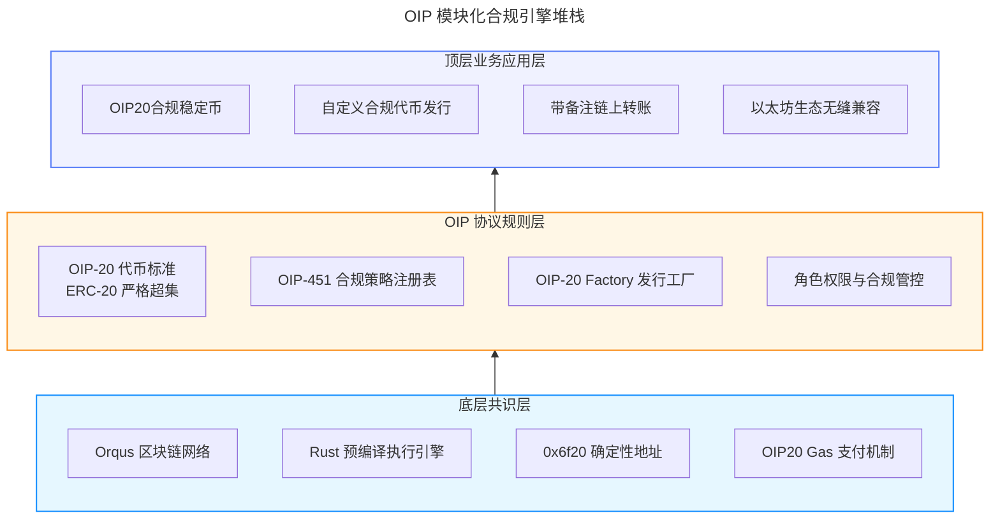

Read [](file:///home/huzy/workspace/think)

Read [](file:///home/huzy/workspace/think/merkle)

Read memory

Analyzing your answers...

基于设计文档，我现在整理完整的实现计划。 

Created memory file [](file:///home/huzy/.vscode-server/data/User/workspaceStorage/ee0a0005eb534f57a9451bbd4fd1d2a1/GitHub.copilot-chat/memory-tool/memories/MTY4NTQ1MDgtNDUyMS00MDUwLTlmODMtYTUyM2ZhY2YxMGM3/plan.md)

---

## Plan: QMDB Go 执行引擎实现

**TL;DR**：用 Go 实现 QMDB 执行引擎，CSV 文件模拟 SSD 追加写，兼容 Ethereum StateDB + Trie 两层接口，每次写操作后自动刷新 6 个观测 CSV 文件，16 Shard 各跑一个 Goroutine。

---

### 目录结构

```
merkle/qmdb/
├── go.mod
├── main.go                      # Demo：模拟文档中的逐步推演
├── types/
│   ├── entry.go                 # Entry 核心数据结构
│   └── version.go               # Version = BlockHeight<<32 | TxIndex
├── crypto/
│   └── hash.go                  # Keccak256、NullHash 哨兵值
├── twig/
│   ├── twig.go                  # Twig 结构体 + 四状态机 (Fresh→Full→Inactive→Pruned)
│   └── merkle.go                # 2048 叶子内部 Merkle 树
├── shard/
│   ├── shard.go                 # Shard 核心逻辑（Get/Insert/Update/Delete + NextKey 链表）
│   ├── btree_index.go           # 内存 B 树索引：[9]byte 前缀 → uint64 Entry ID
│   └── append_log.go            # CSV 追加日志（模拟 SSD 顺序写）
├── upper_tree/
│   └── upper_tree.go            # 上层 Merkle 树（Twig 根哈希 → 全局状态根）
├── compaction/
│   └── compaction.go            # 确定性 Compaction Worker
├── db/
│   ├── db.go                    # QMDB 主结构体（协调 16 Shard + UpperTree）
│   └── tx.go                    # BeginBlock/EndBlock/BeginTx/CommitTx
├── eth/
│   ├── interfaces.go            # ETH 接口定义（Trie + StateDB）
│   ├── trie.go                  # Trie 接口实现（适配 QMDB Get/Update/Delete 等）
│   ├── statedb.go               # StateDB 接口实现（账户级别读写）
│   └── account.go               # Account 结构 + 二进制编码进 224B Value
└── observe/
    ├── observer.go              # 观察器（每次写操作后自动 dump）
    └── csv_writer.go            # CSV 工具函数
```

---

### 观测 CSV 文件（`./data/` 目录）

| 文件 | 内容 | 更新时机 |
|------|------|----------|
| `entries_shard_N.csv` | Shard N 的所有 Entry 记录（追加写，含全部字段） | 每次有新 Entry 写入 |
| `index_shard_N.csv` | B 树索引快照（key_prefix_hex, entry_id, offset） | 每次 Get/Set 后重写 |
| `twig_registry.csv` | 所有 Twig 状态（id, shard, status, active_count, root_hash） | Twig 状态变化时 |
| `fresh_twig_shard_N.csv` | Fresh Twig 叶哈希 + 内部 Merkle 节点 | 每次 Entry 写入后 |
| `upper_tree.csv` | 上层 Merkle 树全部节点（position, hash） | 每次 Twig 根哈希变化 |
| `global_state.csv` | 状态根 + 区块高度 + Entry 总数（带时间戳） | 每次写操作后追加 |

---

### 核心数据结构

**Entry（逻辑 ~312 B）**
- `Id` uint64 — 全局递增，`Id÷2048`=所在 Twig，`Id%2048`=槽位
- `Key` [28]byte — 应用层 Key 的 Keccak256 哈希（前 4 位决定 Shard）
- `Value` []byte — 原始状态值（最大 224 B），StateDB 负责编解码
- `NextKey` [28]byte — 有序链表中紧邻的后继 Key（非存在证明基础）
- `OldId` uint64 — 同 Key 的上一版本 Entry（历史值回溯链）
- `OldNextKeyId` uint64 — 前一个记录此 NextKey 变化的 Entry（历史邻居关系链）
- `Version` uint64 — `BlockHeight<<32 | TxIndex`（精确到交易粒度）

**Twig（TwigSize = 2048）**

| 状态 | 内存占用 | 说明 |
|------|---------|------|
| `Fresh` | ~640 KB | `Leaves[2048][32]byte` + `Nodes[4096][32]byte`，内部 Merkle 树完整 |
| `Full` | 288 B | 仅 `RootHash[32]byte` + `ActiveBits[256]byte` |
| `Inactive` | 288 B | ActiveBits 全为 0 |
| `Pruned` | 0 B（仅上层树占位）| 只剩上层树中 32 B 哈希 |

---

### ETH 接口层

**Trie 接口**（参考 go-ethereum `trie.Trie`）
```go
Get(key []byte) ([]byte, error)
Update(key, value []byte) error
Delete(key []byte) error
Hash() common.Hash
Commit() (common.Hash, error)
Prove(key []byte, proofDB ethdb.KeyValueWriter) error
ProveNonExistence(key []byte, proofDB ethdb.KeyValueWriter) error  // QMDB 扩展
GetAtVersion(key []byte, version uint64) ([]byte, error)           // QMDB 扩展
```

**StateDB 接口**（参考 go-ethereum `core/state.StateDB`）
```go
GetBalance/AddBalance/SubBalance, GetNonce/SetNonce
GetCode/SetCode/GetCodeHash, GetState/SetState(storage)
Exist/Empty/CreateAccount/DeleteAccount
IntermediateRoot(deleteEmptyObjects bool) common.Hash
Prepare(thash common.Hash, ti int)   // 设置当前交易
Finalise(deleteEmptyObjects bool)
Commit(block uint64) (common.Hash, error)
Snapshot() int / RevertToSnapshot(id int)
```

---

### 实施步骤

**Phase 1 — 核心类型**（`types/`, `crypto/`）
1. 定义 `Entry`、`Version`
2. Keccak256 工具函数 + `NullHash` 哨兵值（空槽位用）

**Phase 2 — Twig Merkle 树**（`twig/`）
3. 2048 叶子内部 Merkle 树（build/update/proof 提取）
4. Twig 状态机（Fresh→Full→Inactive→Pruned）
5. `Fresh→Full` 转换：刷 CSV + 释放内部节点 + 保留 288 B

**Phase 3 — Shard**（`shard/`）
6. B 树索引（依赖 `github.com/google/btree`）
7. CSV 追加日志（模拟 SSD 顺序写）
8. `Get`（内存索引 → 1 次 CSV 读）
9. `Insert`（新账户）：读前驱 → 追加 2 条 Entry → 更新 NextKey 链表
10. `Update`（改值）：追加 1 条 Entry
11. `Delete`（删账户）：追加前驱新版本 → 更新 NextKey 链表
12. MIN/MAX 哨兵 Entry 初始化

**Phase 4 — 上层 Merkle 树**（`upper_tree/`）
13. 维护 Twig 根哈希 → 全局状态根，Fresh Twig 根变化时增量更新

**Phase 5 — QMDB 主结构**（`db/`）
14. `QMDB` 协调 16 Shard + UpperTree（每 Shard 1 个 Goroutine）
15. `BeginBlock / EndBlock / BeginTx / CommitTx`

**Phase 6 — ETH 接口**（`eth/`）
16. `Account` 编解码（Balance + Nonce + CodeHash + StorageRoot → ≤224 B 二进制）
17. `Trie` 接口适配 QMDB 底层操作
18. `StateDB` 接口实现（缓存层 + 批量提交到 Trie）

**Phase 7 — 观察器**（`observe/`）
19. 每次写操作后自动重写 6 个 CSV（`index_shard_N.csv` 等）
20. `global_state.csv` 追加形式，记录每步操作的状态根演变

**Phase 8 — Compaction**（`compaction/`）
21. `ActiveBits` 追踪（旧 Entry 失效时置 0）
22. 确定性触发：`active_count / 2048 < 0.5`
23. Compaction 执行：顺序读旧 Twig → 追加新 Entry → 旧 Twig 变 Inactive

**Phase 9 — Demo**（`main.go`）
24. 复现文档中的推演示例（MIN→alice→bob 链，h=100/200/350 的操作）
25. 每步打印当前状态根 + 提示查看哪个 CSV

---

### 关键依赖决策
- **外部库**：`github.com/google/btree`（B 树索引）+ 标准库 `encoding/csv`
- **无 go-ethereum 依赖**：`common.Hash` / `common.Address` 自定义（避免重型依赖），接口签名兼容
- **Compaction 触发**：`active_count / TwigSize < 0.5`（基于 Entry 计数，全节点确定性一致）
- **并发模型**：每个 Shard 独立 goroutine，channel 传递操作；观察器异步 CSV 写入不阻塞主路径

---

### 验证步骤
1. 运行 `go test workspace.` — 验证各层单元测试
2. 运行 `main.go` — 观察 `data/` 目录下 CSV 文件随每步操作的变化
3. 验证：`entries_shard_*.csv` 中 `NextKey` 链表顺序正确
4. 验证：`fresh_twig_shard_N.csv` 中内部 Merkle 节点构成有效二叉树
5. 验证：计算任意 Entry 的 Merkle 路径，对比 `global_state.csv` 中状态根

---

计划已保存。请确认方案，或提出调整意见，确认后即可进入实现阶段。


